# 原生小程序的文件目录

app.js 是项目的入口文件,应用全局处理逻辑
app.json是全局配置
app.wxss ...

app.wxss 是css样式文件的一个仿品,多了个 rpx 在做移动端适配的时候使用rpx完美适配所有机型,小程序整个宽度为 750rpx,可以根据比例调试

project.config.json 项目配置文件 主要是为了区分前后端代码的文件夹在哪


## app.js

* 生命周期钩子函数
* 全局getApp函数获取实例
* 全局唯一

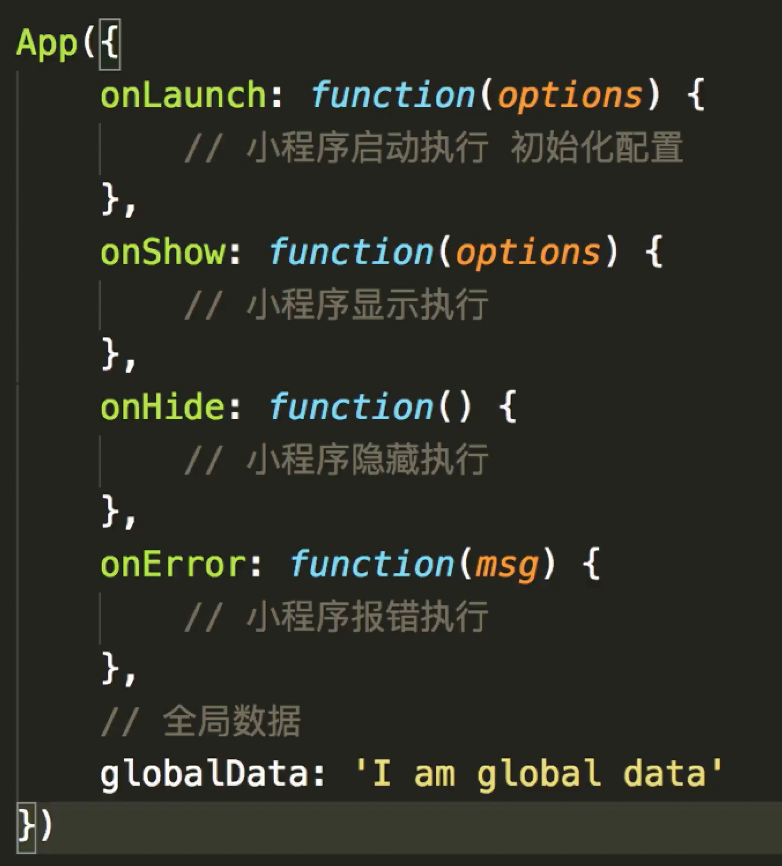

## app.json

* pages
* windows
* tabbar

https://developers.weixin.qq.com/miniprogram/dev/framework/config.html

pages : 指定小程序页面文件,第一个默认为首页,在使用mpvue的时候自动生成改文件

```js
{
  "pages": [
    "pages/index/index",
    "pages/logs/index"
  ],
  "window": {
    "navigationBarTitleText": "Demo"
  },
  "tabBar": {
    "list": [{
      "pagePath": "pages/index/index",
      "text": "首页"
    }, {
      "pagePath": "pages/logs/logs",
      "text": "日志"
    }]
  },
  "networkTimeout": {
    "request": 10000,
    "downloadFile": 10000
  },
  "debug": true
}
```

## 常用api

* wx.request 发送请求
* wx.previewImage 预览图片
* wx.setStorage | getStorage 本地存储


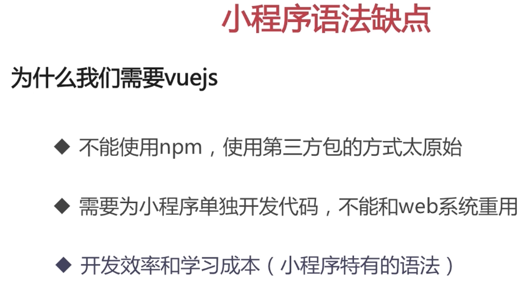
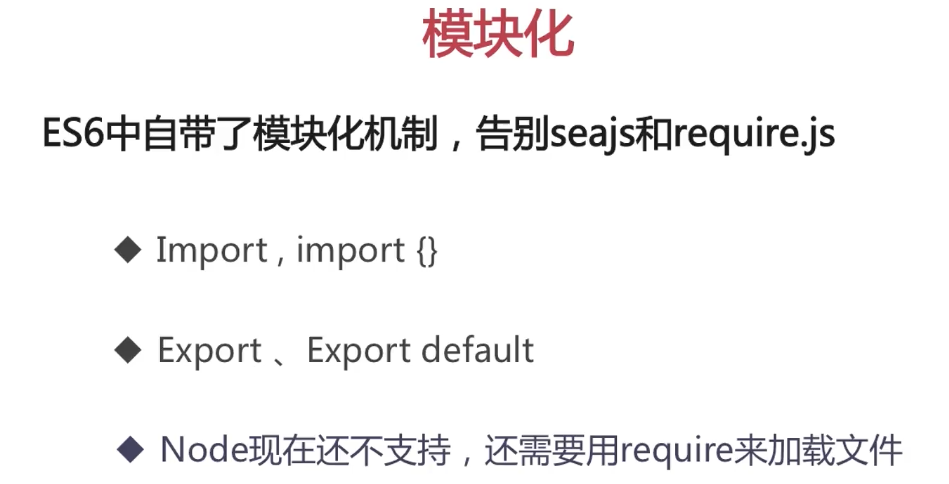

## ES6 常用的代码片段

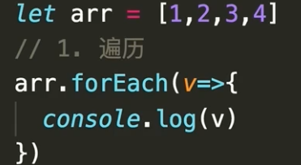
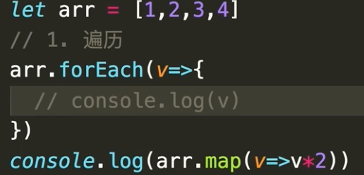
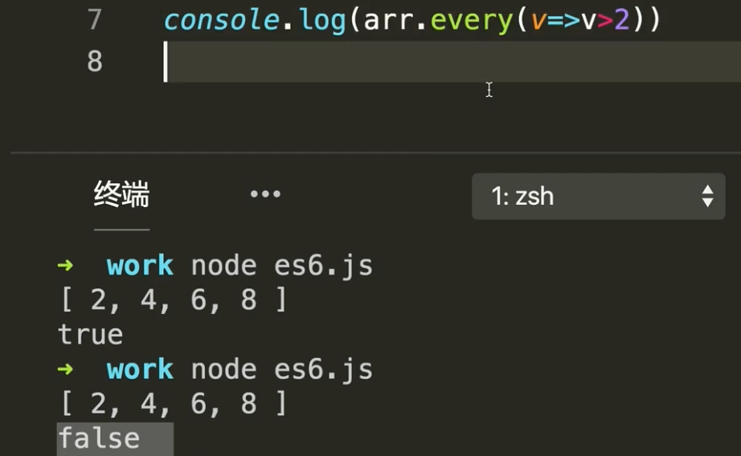
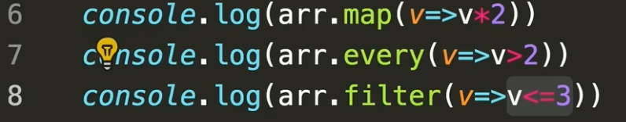

### 可以链式调用

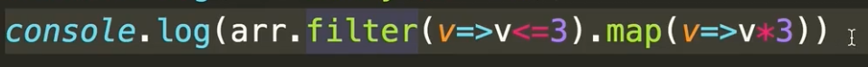

## 数组去重使用set的特性

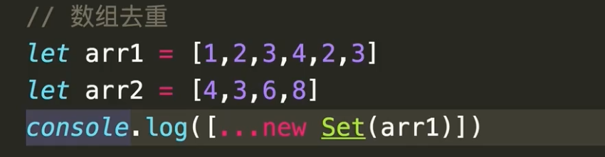
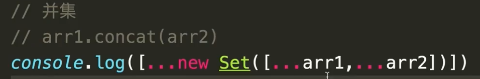


## 面试 淘宝首页到底用了多少种标签?

综合应用上面的片段

```js
// 获取所有标签元素
document.querySelectorAll('*')
// 展开为数组(原生nodelist)
[...document.querySelectorAll('*')]
// 遍历数组
[...document.querySelectorAll('*')].map(v => v.nodeName)
// 去重
new Set([...document.querySelectorAll('*')].map(v => v.nodeName)).seze
```


## 对象的遍历
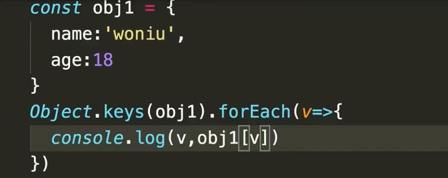

## 对象合并(使用展开符)

```js
console.log({...obj1,..obj2,job:'fe', age:16})
```

## rpx是什么

https://developers.weixin.qq.com/miniprogram/dev/framework/view/wxss.html

rpx是一个响应式的设计单位
一般是以iphone6为视觉标准使用rpx设计,在iPhone6中一个1rpx = 0.5px


## 生命周期

小程序的生命周期有两种

* app
* page

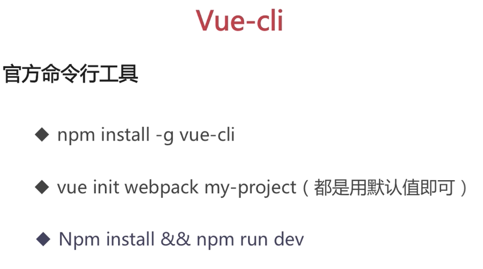


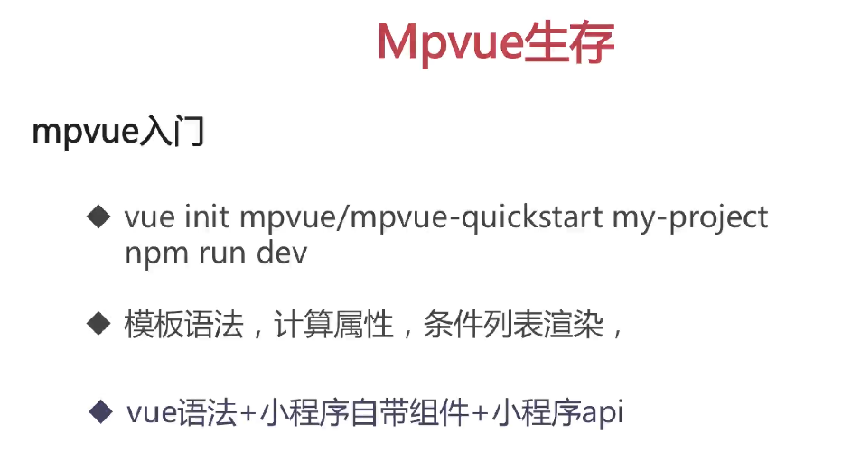


每个页面都有main.js 它的意思是, 使用的app是index.js,
将其挂载到vue当中

```js
import Vue from 'vue'
import App from './index'

const app = new Vue(App)
app.$mount()
```

为什么mpvue 中的new Vue(App)可以挂载 网页?

这里面隐含了一个问题就是,通过import app from './index'将网页导入进来的时候,是原来的网页吗? 是一堆template JavaScript 以及 style这些标签吗?
是否经过了框架层层处理?

https://segmentfault.com/q/1010000011723029


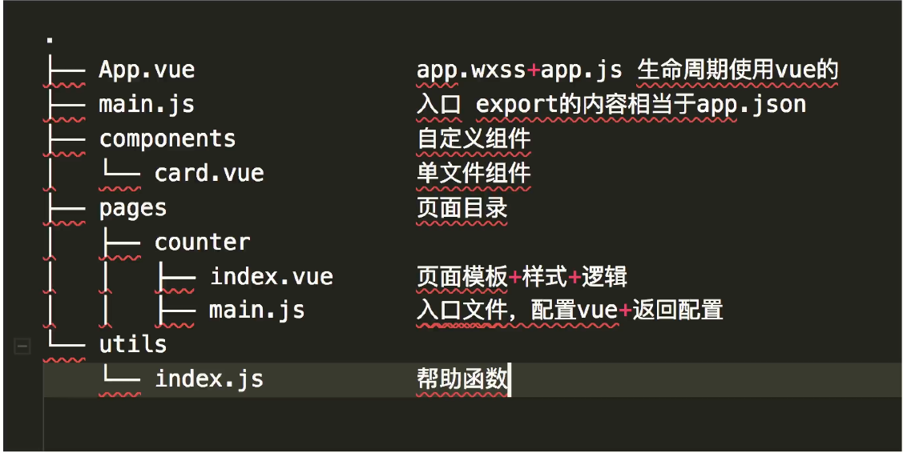

mpvue 推荐使用vue的声明周期,因为小程序在别的web端是没有周期的

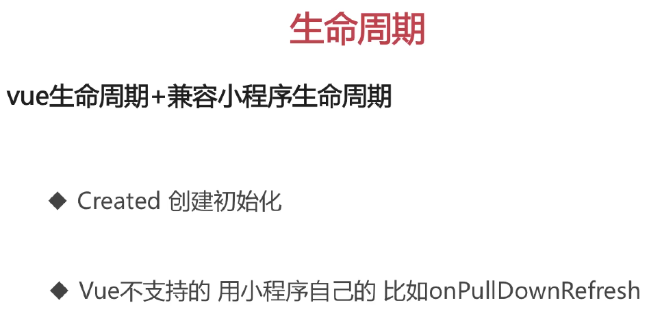
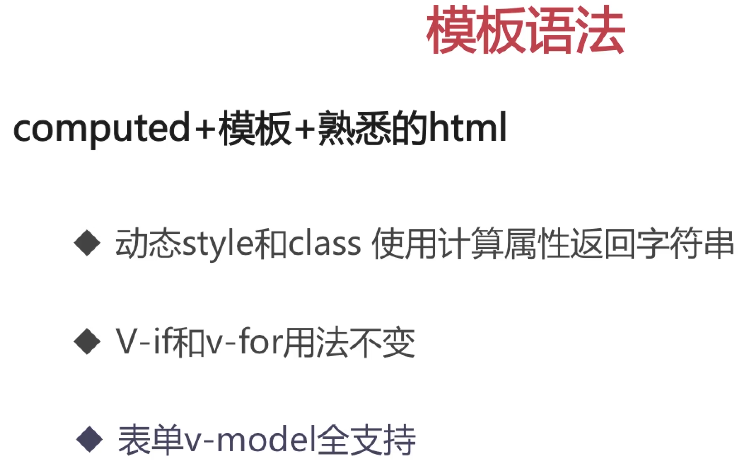
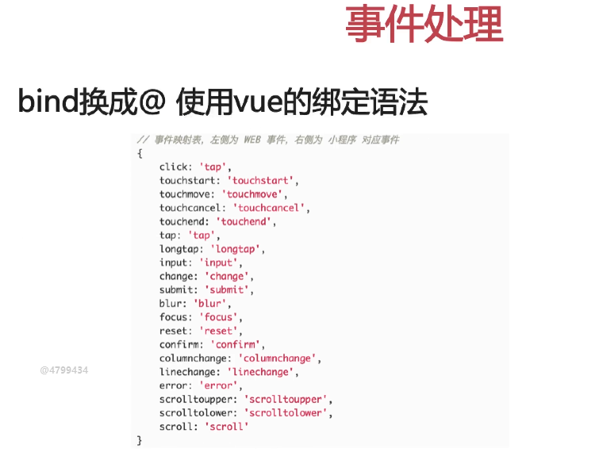
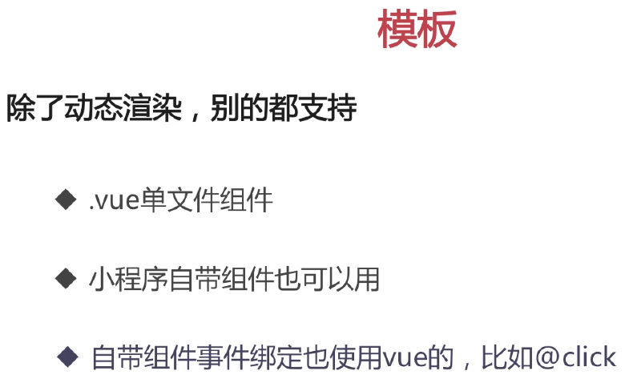


## koa是什么
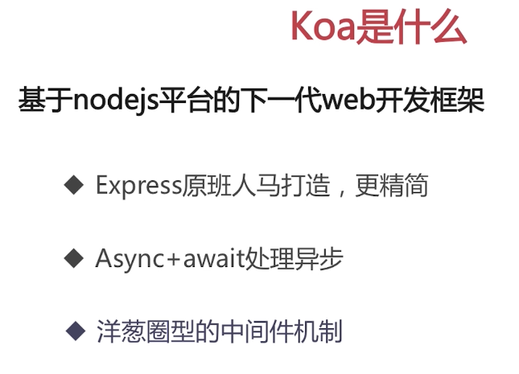
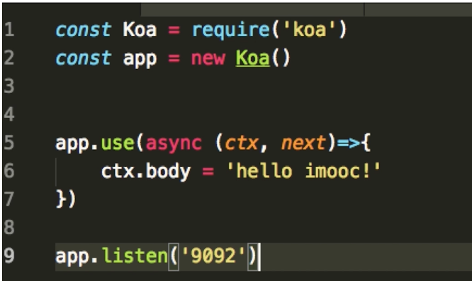
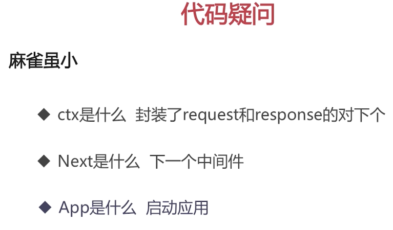

洋葱圈模型(先进先出)

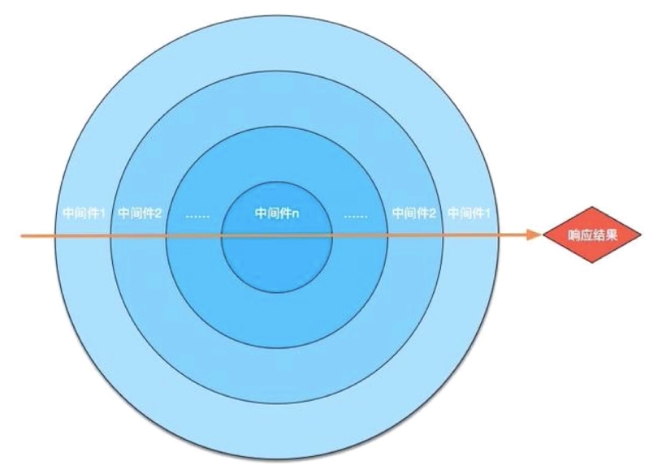

app.use 就是一个

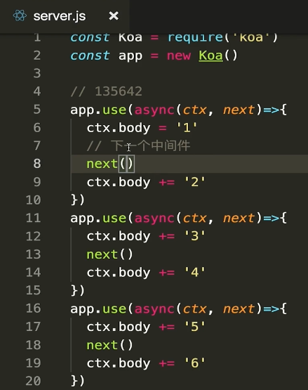

执行顺序是135642


## koa2 中间件是什么?


koa 的使用

npm init

npm i koa --save

## 腾讯云

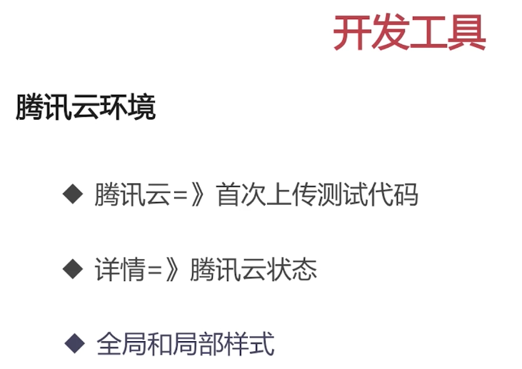
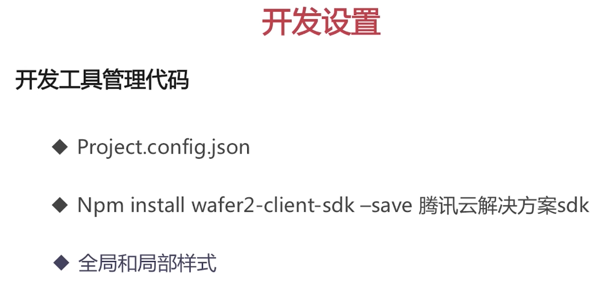
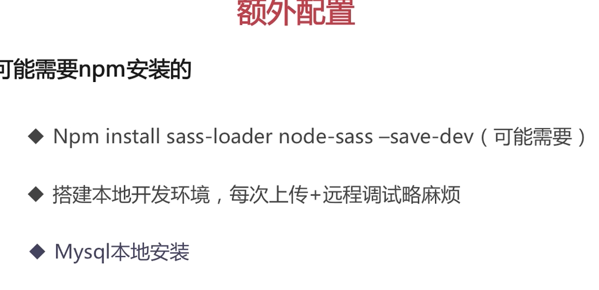


## 本地如何搭建开发环境
https://cloud.tencent.com/document/product/619/12794

https://console.cloud.tencent.com/cam/capi


启动mysql

docker start mysql

进入到数据库命令行

docker exec -it mysql mysql -uroot -p123456

create database cAuth;


在server文件夹中npm install

服务器热更新
npm i nodemon -g

操作mysql 数据库的库knex

## 使用mpvue框架删除src目录

注意: 入口App.vue 中template不写东西报错, con n't find for 加入一层 div即可

或者不写template即可

app.json 是在mpvue中 main.js 中定义的


新建pages文件夹

 main.js

## 自动修复eslint报错文件

 "lint": "eslint --fix --ext .js,.vue src"
 npm run lint

 /* eslint disable */ 关闭eslint检查文件

 
